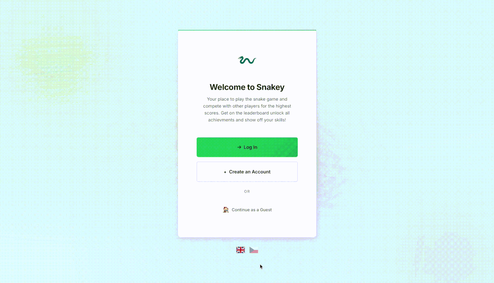
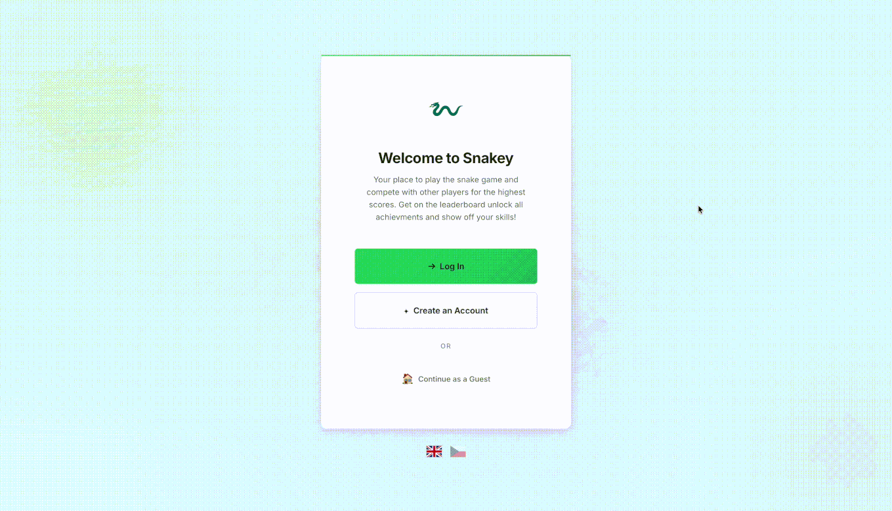
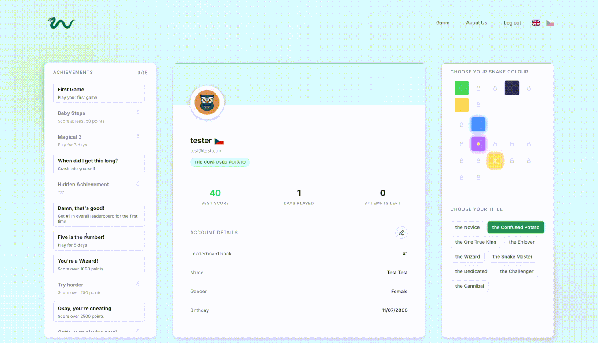
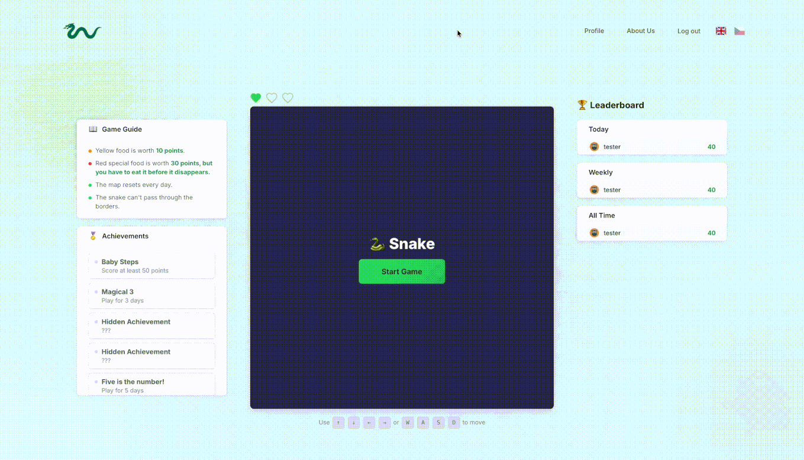

# Snakey

A modern web application built with **Next.js** and **React**. Snakey is a browser-based take on the snake game we all grew up with.

## ✨ Key Features

- 🔐 **Secure Authentication:** Full user sign-up and login flows, including encrypted passwords using bcryptjs.
- 🐍 **Snake game:** Including generated obstacles, special food, implemented Achievments & Leaderboard system
- 👤 **Custom User Profiles:** Authenticated users have dedicated profile pages to manage their accounts.
- 🌍 **Bilingual Support:** Users can switch between English and Czech
- 🎨 **Modern UI:** Clean, intuitive design that looks great on desktop and mobile.
- ⚡ **Lightning Fast Data:** Uses LibSQL/Turso for a high-performance, edge-ready database.
- 📱 **Modern & Responsive:** Built on Next.js 16 with a clean UI that looks great on any device.

## 🛠️ Built With

- **[Next.js](https://nextjs.org/)** – The React framework 
- **[React](https://reactjs.org/)** – Frontend UI library
- **[LibSQL / Turso](https://turso.tech/)** – SQLite database for fast data storage
- **[Bcrypt.js](https://www.npmjs.com/package/bcryptjs)** – For secure password hashing and encryption
- **[CSS Modules](https://nextjs.org/docs/app/building-your-application/styling/css-modules)** – For clean, component-scoped styling
- **[Vercel](https://vercel.com/)** – Cloud platform for seamless deployment and hosting

## 📸 Showcase

Landing Page for Logging In, Registering or just enjoying the app as a Guest. Possibility to switch languages as well.

Sign-up and Login Validations

Registering an account, choosing a profile picture and a username

User profile page, custom country flag, achievments, customizable snake colours, and titles. Profile details are editable.

Gameplay and unlocked achievment animation

## E2E Cypress Testing